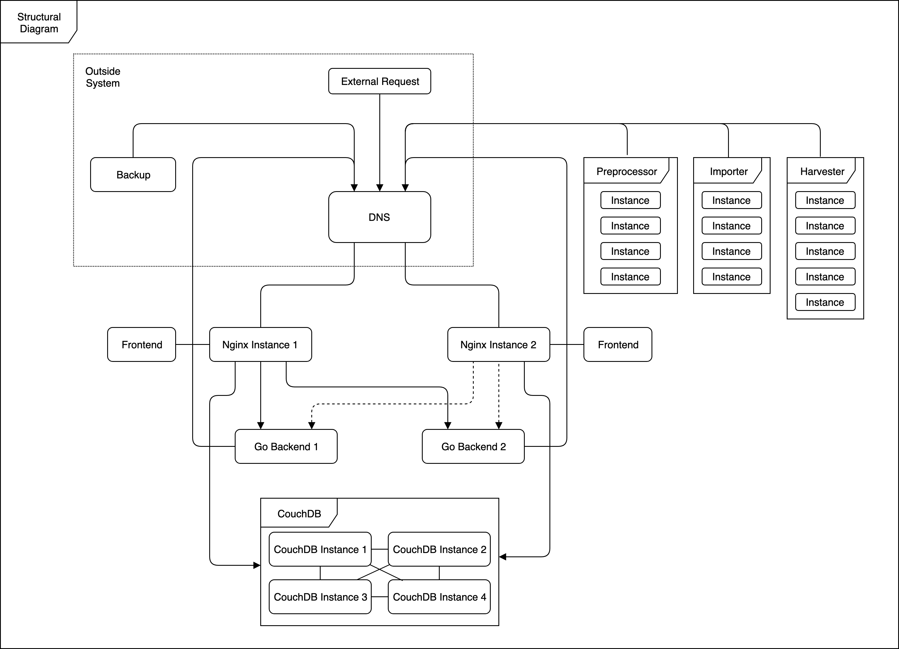
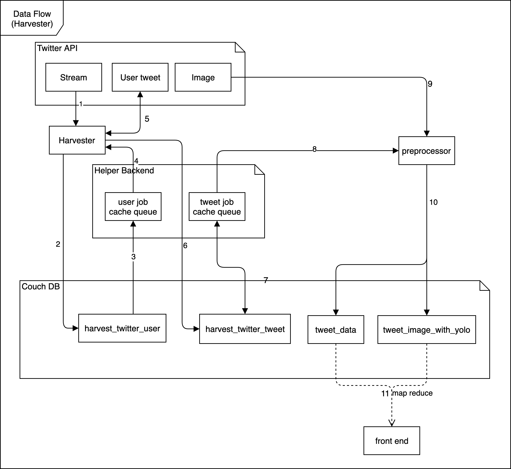
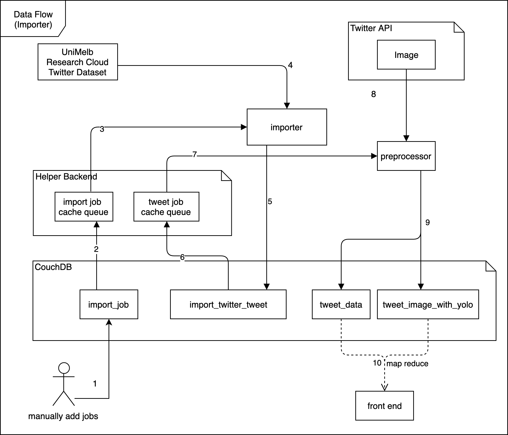

# CCC_Project_2
[](#contributors)
[](https://github.com/CaviarChen/CCC_Project_2/blob/master/LICENSE)

[](https://www.youtube.com/watch?v=HiE8ropg83Q)

**Frontend demo starts at 5:22**


## Project Details
The focus of this project is to explore the Seven Deadly Sins through social media Twitter data analytics. Based on this large amount of data increased continuously, it is essential to build an software architecture that supports handling big data. We choose the Microservice architectural style and built a distributed data harvest import process and visualization system. ​Finally, we combined the processed data with statistical data from Australian Urban Research Infrastructure Network (AURIN) platform, in order to discover certain scenarios which tell interesting stories related to Gluttony, as one of seven deadly sins.

### Team 42
Minjian Chen 813534  
Shijie Liu 813277  
Weizhi Xu	752454  
Wenqing Xue 813044  
Zijun Chen 813190  

## Technical Details
### Folder Structure
```js
/
├── automation/         // Ansible script used to set up and deploy this project on OpenStack
├── common_script/      // Common script for management
├── frontend/           // Code for frontend
├── go_backend/         // Helper Backend
├── harvester/          // Harvester
├── importer/           // Importer
└── preprocessor/       // Preprocessor
```

### Architecture


### Data Flow




## Full Report
[Full Report](Report.pdf)
